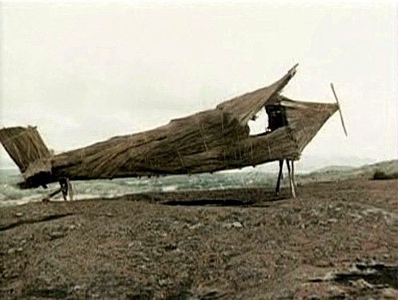

# WARNING

## Democratization of Computation

+ Computational tools are cheap and ubiquitous
+ Computational power is cheap and ubiquitous
+ This is good
+ But also is dangerous

## Cargo-Cult data analysis

Don't fall into the trap of [Cargo-Cult](https://www.britannica.com/topic/cargo-cult) Data Analysis.

+ Having data and making calculations with data doesn't mean you're doing data analysis.
+ Emphasis is on **analysis** not on **computation**.

# Statistical tests

## "Einmal ist keinmal"

+ Statisticians have a good catalogue of random phenomena.
+ They also have *tests* to distinguish random variables.
+ Tests come with *confidence levels* and *confidence intervals*.

## Hypothesis testing

+ Formulate two disjoint hypotheses H0 and H1 where H0 is default.
+ Design a measure (statistic) that distinguishes H0 from H1.
  - either reject H0 and accept H1
  - or fail to reject H0
    + then what?
  
## Types of things we can test and measure

+ Means and variances
+ Whether measurements are different
+ Dependence between numerical variates
+ Dependence between categorical variates

## Example 1

Say we have two models and data is split into 5, and we evaluate the
cost/fit function on these models.

| Model 1  | Model 2  |
|----------|----------|
| 1.025045 | 1.238022 |
| 1.088714 | 1.258800 |
| 0.926672 | 1.159097 |
| 1.014031 | 1.199927 |
| 1.138273 | 1.318249 |

+ Are these models different? 
+ For the cost values above we use [paired t-test][1]

    test-statistic = -5.35, p-value=0.0005

[1]: https://en.wikipedia.org/wiki/Student's_t-test#Dependent_t-test_for_paired_samples

## Example 2

### Data

| Expected | Model 1 | Model 2 |
|:---------|:--------|:--------|
| A        | A       | A       |
| A        | B       | B       |
| A        | A       | B       |
| ...      | ...     | ...     |
| B        | B       | A       |
| B        | B       | B       |

----

### Confusion matrix

~~~~ {.ditaa}
                     Model 1                            Model 2

                     Prediction                        Prediction 
                     +----+----+                       +----+----+
                     |  A |  B |                       |  A |  B |
                 +---+----+----+                   +---+----+----+
                 | A | 10 |  4 |                   | A |  9 |  5 |
       Expected  +---+----+----+         Expected  +---+----+----+
                 | B |  3 | 12 |                   | B |  7 |  8 |
                 +---+----+----+                   +---+----+----+

~~~~

+ Which of these models is better?
+ There is a [test](https://en.wikipedia.org/wiki/Chi-squared_test) for that.
+ For the tables above:

     Model 1: statistic=8.10, p-value=0.044
    
     Model 2: statistic=1.21, p-value=0.751
    
    
# Supervised Learning

## Data and cost function

+ Data consists of (input, expected output) pairs.
+ We have a measure of *how well the model fits*.
+ Expected output drives the cost function.

$$ \theta_0 = argmin_\theta\ \text{Cost}(\text{Model}(\theta),\text{Data}) $$

## Cross-validation

+ How sure are we about the true value of 
$$ \text{Cost}(\text{Model}(\theta),\text{Data}) $$
+ Need some randomness
+ Split data into pieces and evaluate
+ Analyze statistically

## Cross-validation methods

### Hold-out CV

~~~~ {.ditaa}
                          +------+
+------+       +--------->+ TEST +----------------------------------+
|      |       |          +------+                                  |
| DATA +-------+                                                    |
|      |       |          +-------+        +-----------+            v
+------+       +--------->+       |        |           |       +----+----+
                          | TRAIN +------->+ Algorithm +------>+  Model  |
                          |       |        |           |       +----+----+
                          +-------+        +-----------+            |
                                                                    v
                                                             +------+------+
                                                             |    Test     |
                                                             |  Statistic  |
                                                             +-------------+
~~~~

---

### k-fold CV

~~~~ {.ditaa}

+---------+---------+---------+---------+
| Part(1) | Part(2) |   ...   | Part(k) |
+---------+---------+---------+---------+

~~~~

Algorithm

+ For each Part(i) do
+ Train Model(i) on all but Part(i)
+ Test Model(i) on Part(i) and record

----

### Leave-one-out CV

Same as k-fold where each Part(i) is one point.

# Unsupervised Learning

## Data and fit function

+ Data consists of inputs but no expected outputs
+ We again have 
  - a fit function
  - or a cost function
+ Application drives the fit/cost function

# A Case Study

## k-means vs k-nn

+ k-means is an unsupervised clustering model
+ k-nn is a supervised classification model
+ They both split a data set into disjoint subsets

## k-Nearest Neighbors

Setup: 

+ We have labeled data points embedded in a vector space
  $$ (x,p) \qquad x\in \mathbb{R}^n,\ p\in \{1,\ldots,\ell\} $$

+ We need to form a model

~~~ {.ditaa}

  +-----------+         +--------+         +-----------+
  | New Point +-------->+  Model +-------->+ New Label |
  +-----------+         +--------+         +-----------+

~~~

## The Input

+ Input
  + k: the number of neighbors (an odd number)
  + D: a finite subset
  + d: a metric
  + x: a point whose label is unknown
  
## The Algorithm

1. Find k points in D closest to x
2. Get the labels of these k points from D
3. Count the labels and find the most frequent label L
4. Return the label L for x

## Demo

## k-means

Setup: 

+ We have unlabeled data points embedded in a vector space
  $$ x\in \mathbb{R}^n $$

+ We need to form a model

~~~ {.ditaa}

  +-----------+         +---------+         +------------+
  |   Point   +-------->+  Model  +-------->+    Label   |
  +-----------+         +---------+         +------------+

~~~

## The Input

+ Input
  + k: the number of clusters
  + D: a finite subset
  + x: a point whose label is unknown
  
## The Algorithm (Model building)

1. Initialize k empty bags
1. Sample k-random points $x_1$ ,..., $x_k$ from D
2. For each point $x$ determine determine which of $x_i$ is closest
   and put in in bag(i)
3. For each bag(i) find the centroid $y_i$
4. If $x_i$'s are sufficiently close to $y_i$'s return $y_i$'s
5. Let $x_i$ = $y_i$ for i = 1, ... , k and go to step 3

## Prediction

+ Given x and $y_1$, ... , $y_k$ in $\mathbb{R}^n$
+ Find closest $y_i$ to $x$
+ Return i

## Demo
